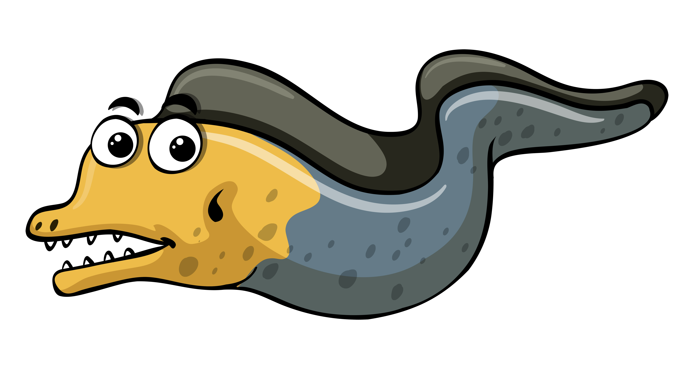

# Capitone 
This repo is created to analyse the motion of WEC system using Nemoh and Capytaine. The main aim is to get results giving in input the least number of informations possible, as geometries in .stl format and other specific mechanical characteristics.  
